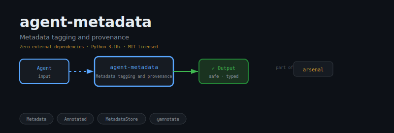
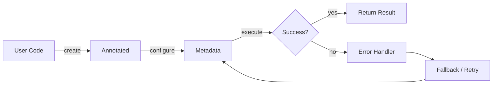
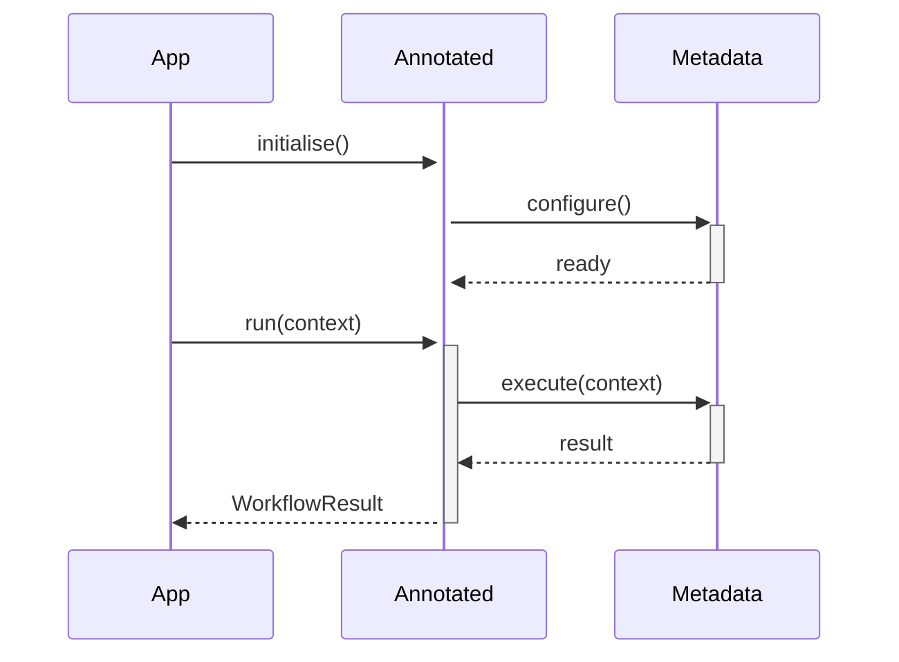

<div align="center">

</div>

# agent-metadata

**Metadata tagging and annotation for agent outputs — provenance, cost, confidence tracking.**

[](https://pypi.org/project/agent-metadata/) [](https://python.org) [](LICENSE) [](#)

---

## The Problem

Without structured metadata, agent outputs are opaque blobs. Debugging which model produced which output, filtering by run-id, or correlating a response to its prompt becomes impossible. Metadata is the provenance layer that makes tracing real.

## Installation

```bash
pip install agent-metadata
```

## Quick Start

```python
from agent_metadata import Annotated, Metadata

# Initialise
instance = Annotated(name="my_agent")

# Use
# see API reference below
print(result)
```

## API Reference

### `Annotated`

```python
class Annotated:
    """Wraps any value with a Metadata object for full provenance tracking."""
    def __init__(self, value: Any, metadata: Metadata | None = None) -> None:
    def value(self) -> Any:
        """The wrapped value."""
    def metadata(self) -> Metadata:
        """The associated Metadata object."""
    def annotate(self, **kwargs: Any) -> "Annotated":
        """Return a new Annotated with extra metadata merged in."""
```

### `Metadata`

```python
class Metadata:
    """Key-value metadata container with built-in fields for agent provenance."""
    def __init__(self, **kwargs: Any) -> None:
    def set(self, key: str, value: Any) -> "Metadata":
        """Set a metadata field. Returns self for fluent chaining."""
    def get(self, key: str, default: Any = None) -> Any:
        """Get a metadata field value, or *default* if not present."""
    def merge(self, other: "Metadata") -> "Metadata":
        """Return a new Metadata with fields from both (other wins on conflict)."""
```


## How It Works

### Flow



### Sequence



## Philosophy

> *Namarupa* — name and form — are the tags that differentiate one phenomenon from another in consciousness.

---

*Part of the [arsenal](https://github.com/darshjme/arsenal) — production stack for LLM agents.*

*Built by [Darshankumar Joshi](https://github.com/darshjme), Gujarat, India.*
